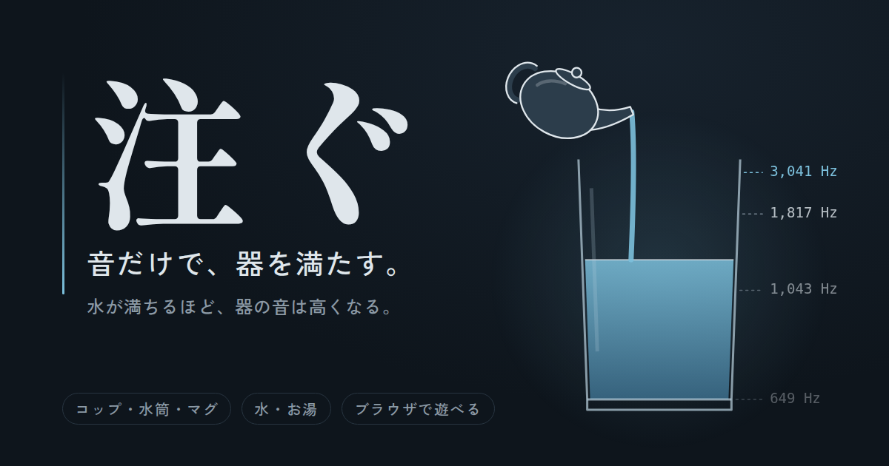

# 注ぐ

水が満ちるほど、器の音は高くなる。
目ではなく耳で、器を満たすブラウザゲームです。

**▶ 遊ぶ：https://kanameshiga-dev.github.io/sosogu/**

## 遊び方

- **通常モード**：ボタン（またはスペースキー）を押しているあいだ、ポットから注がれます。水位は見えません。音だけを頼りに、縁ぎりぎりで離してください。最初に一度だけ、見ながら音を覚える練習があります。
- **お手本モード**：お手本が注ぐ音を聴いて、同じ量を目隠しで注ぎます。注ぐ速さはお手本と違うので、秒数ではなく音を合わせてください。

器は **コップ・水筒・マグ・ワイングラス・徳利**、中身は **水・お湯・氷水・炭酸水・ビール** から選べます。イヤホン推奨です。

## 音のしくみ

鳴っているのは水ではなく、水面から縁までの空気の柱です。

- **コップ・マグ・ワイングラス**：片側が閉じた管の共鳴 `f ≈ c ÷ 4(L + 0.6r)`。空気柱が短くなるほど高く、縁に近いほど上がり方が急になります。ワイングラスは胴が膨らむぶん、途中で水位の上がり方が変わります。
- **水筒・徳利**：胴の空気がバネ、首の空気がオモリになるヘルムホルツ共鳴。水が首に届くと管の共鳴に切り替わり、一気に高くなります。徳利は肩ですぼまるので、首の手前で音が駆け上がります。
- **お湯・氷水**：温まった空気は音速が速く少し高く、冷えた空気は音速が遅く少し低く鳴ります（お湯で約 0.6 半音高く、氷水で約 0.5 半音低く）。
- **炭酸水**：はじける泡の雑音が共鳴に重なります。
- **ビール**：泡の上面が空気の柱の底になります。泡は注ぐほど立ち、音を吸うので共鳴がこもります。泡で溢れることもあります。

音はすべて Web Audio API でその場で合成しています。音声ファイルは使っていません。

## 動作

HTML 1ファイルで動きます。ビルドや外部ライブラリは不要です（フォントのみ Google Fonts から読み込み）。
